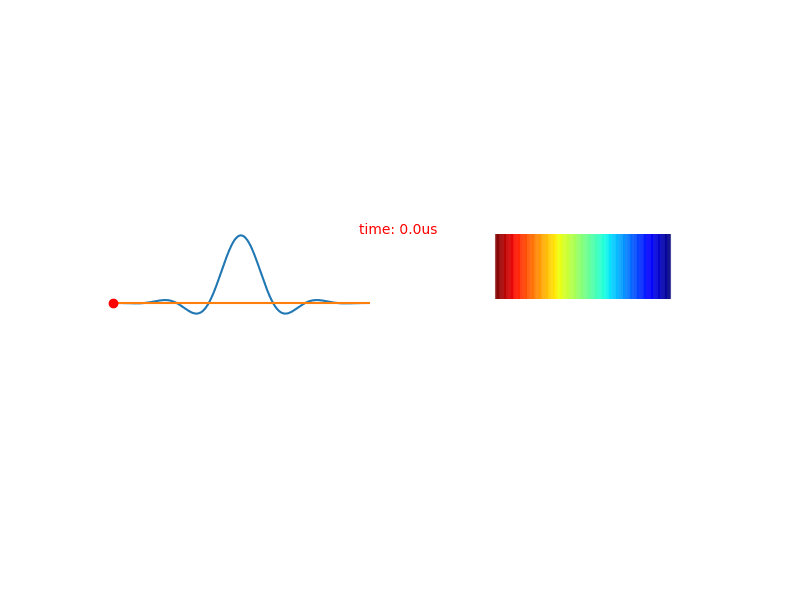

# pymri_recon

MRI reconstruction package
This repo provides an introduction to magnetic resonance imaging (MRI). With two powerful components - sequence simulation and parallel imaging simulation - this software is designed to help you better understand and optimize MRI techniques.

This code boasts a robust sequence simulation module featuring an SSFP sequence with advanced capabilities such as bssfp phase cycling, quadratic RF spoiling, and N periodic bSSFP. This allows you to simulate and analyze the performance of these sequences, helping you to identify and optimize your SSFP parameters. Additionally, I've also implemented a C++ version of this module (with a python interface) that is more than 100 times faster than the python implementation, ensuring that you can quickly and easily run simulations without sacrificing performance.

The parallel imaging simulation component includes the basic of conventional parallel imaging (SENSE, cgSENSE, and two versions of GRAPPA). This allows you to simulate parallel imaging techniques with fully sampled data. This module also includes a g-factor map to help users visualize their imaging results. With this, you can better understand the strengths and limitations of these techniques and make informed decisions about MRI reconstruction techniques.


## set up
Clone the github repo in to local 
```bash
git clone https://github.com/ZimuHuo/pymri_recon.git
```
Create conda env from .yml files 
```bash
cd pymri_recon
conda env create -f environment.yml
```
Acvtivate the conda environment
```bash
 conda activate pymrirecon
```
I used twixtools to read the file, you can also use pymapvbvd. 
```bash
git clone https://github.com/pehses/twixtools.git
cd twixtools
pip install .
```

Navigate to the pymrirecon folder and download example data
```bash
mkdir lib
cd lib
```

I prepared three example data. However, the dicoms are not available because my personal information is there.
https://drive.google.com/drive/folders/1-e5ywHM5BFP9od-_Yo_9E8E_1aYidrIy?usp=sharing

Example data: 
1. FLASH single slice phantom data 
2. 4-slice phantom data
3. Single-shot EPI in-vivo scan mid short axis view of left ventricle


# MRI pulse sequence simulator 

alomost there, will upload code soon

## Sinc pulse


## Sinc pulse profile 



## Hard pulse 


## Hard pulse profile 


## TSE


## TSE 90-130-130-130


## bSSFP


